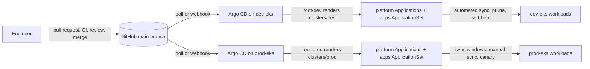

# k8s-gitops-platform

[](https://github.com/michealzs/k8s-gitops-platform/actions/workflows/ci.yml)
[](LICENSE)

GitOps configuration for a small production Kubernetes platform on AWS EKS: two clusters (`dev-eks` and `prod-eks`), each reconciled by its own Argo CD from this repository. Platform components come from upstream Helm charts pinned to exact versions. Workloads are plain Kustomize. Prod ships behind sync windows, manual sync and a canary analysis; dev syncs on every merge. Nothing is applied by hand after bootstrap, and nothing secret is in git.



## Layout

```text
.
├── bootstrap/
│   ├── argocd/            Argo CD managing itself: Application for the argo-cd chart + values.yaml
│   ├── dev/               kubectl apply -k: the argocd Application (dev hostname) + root-app.yaml
│   └── prod/              same for prod
├── clusters/
│   ├── base/              AppProjects, one Application per platform component, kyverno-policies
│   ├── dev/               ApplicationSet for apps/, Karpenter NodePool, values-dev.yaml patches
│   └── prod/              same, plus sync windows and a manual-sync ApplicationSet
├── platform/
│   ├── argo-rollouts/     each: application.yaml (pinned chart), values.yaml, values-dev.yaml, values-prod.yaml
│   ├── cert-manager/        + resources/ with the Let's Encrypt ClusterIssuers
│   ├── external-dns/
│   ├── external-secrets/    + resources/ with the AWS Secrets Manager ClusterSecretStore
│   ├── ingress-nginx/
│   ├── karpenter/           + resources/<cluster>/ with EC2NodeClass and NodePool
│   ├── kube-prometheus-stack/ Grafana, alert rules, ServiceMonitor selector, + resources/ (Grafana admin ExternalSecret)
│   ├── kyverno/
│   └── metrics-server/
├── apps/
│   └── podinfo/
│       ├── base/          Deployment, Service, HPA, PDB, NetworkPolicy, ServiceAccount, Ingress, ServiceMonitor
│       ├── components/rollout/  Argo Rollouts canary + AnalysisTemplate, used by prod only
│       └── overlays/      dev/ and prod/: namespace, replicas, resources, hostname, pinned image tag
├── policies/              Kyverno ClusterPolicies (Audit): resource limits, no latest tag, runAsNonRoot
├── docs/                  architecture.md, promotion.md, runbook.md
├── scripts/validate.sh    kustomize build + kubeconform for every kustomization
└── .github/workflows/     yamllint, kustomize + kubeconform, kube-linter, actionlint
```

## How a change ships

1. A pull request edits a dev file: `apps/<name>/overlays/dev/` or `platform/<component>/values-dev.yaml`.
2. CI renders every kustomization, validates it against the Kubernetes and CRD schemas, lints it, and a reviewer approves.
3. On merge, Argo CD on `dev-eks` syncs within minutes. Watch it.
4. A second pull request makes the same change to the prod file. On merge, prod platform components sync inside their window; prod workloads wait for `argocd app sync`, then roll out as a canary that aborts itself if the success rate drops under 99 percent.

The details, including chart version bumps and rollback, are in [docs/promotion.md](docs/promotion.md).

## Bootstrap a cluster

Prerequisites: an EKS cluster from `terraform-aws-platform` with its IAM roles for IRSA, subnets and security groups tagged `karpenter.sh/discovery=<cluster>`, a kubeconfig for it, and `helm`, `kubectl` and `argocd` on your machine. The steps below use `prod`; substitute `dev` for the dev cluster.

```sh
# 1. Install Argo CD once, by hand, with the same values Argo CD will manage later.
helm repo add argo https://argoproj.github.io/argo-helm
helm install argocd argo/argo-cd --version 10.9.2 \
  --namespace argocd --create-namespace \
  --values bootstrap/argocd/values.yaml \
  --set global.domain=argocd.example.com

# 2. Hand the release to Argo CD and create the root Application for this cluster.
kubectl apply -k bootstrap/prod

# 3. Watch the app-of-apps come up, wave by wave.
kubectl -n argocd port-forward svc/argocd-server 8080:80 &
argocd login localhost:8080 --plaintext --username admin \
  --password "$(kubectl -n argocd get secret argocd-initial-admin-secret -o jsonpath='{.data.password}' | base64 -d)"
argocd app wait root-prod --health --timeout 1800
argocd app list
```

Argo CD now owns its own release. Once ingress-nginx, cert-manager and external-dns are healthy, `argocd.example.com` resolves and serves a Let's Encrypt certificate, and the port-forward can go. Delete the `argocd-initial-admin-secret` after SSO is confirmed.

## Conventions

- **Naming.** Argo CD Applications are named after the component or the app directory. Namespaces match Application names. Clusters are `<env>-eks`. Hostnames are `<service>.example.com` in prod and `<service>.dev.example.com` in dev.
- **Pinning.** Every chart has an exact `targetRevision`. Every image has an exact tag, set by the `images:` transformer in the overlay. Every GitHub Action is pinned to a major version and every CLI in CI to an exact version.
- **One Application per component.** A platform component is one chart, one Application, one directory. Custom resources a component needs live in `resources/` under it, synced one wave later.
- **Environment differences are files, not branches.** `values-<env>.yaml` and `overlays/<env>` are the only places dev and prod diverge. `main` is the only branch Argo CD reads.
- **Secrets never in git.** External Secrets pulls them from AWS Secrets Manager through IRSA. Values files reference secret names, never values.
- **Workloads are self-contained.** Requests and limits, probes, a restricted security context, a NetworkPolicy, a PodDisruptionBudget and a ServiceMonitor ship with every app. Kyverno audits the same rules cluster-wide.
- **Prod is deliberate.** Sync windows on both projects, no automated sync for workloads, canary with analysis for the sample app.

## Validation

```sh
export PATH="$HOME/.local/bin:$PATH"   # wherever kustomize and kubeconform live
scripts/validate.sh                    # every kustomization: kustomize build | kubeconform -strict
RENDER_DIR=rendered scripts/validate.sh  # keep the rendered YAML, e.g. for kube-linter
python3 -m yamllint -c .yamllint.yaml .
actionlint
shellcheck scripts/validate.sh
```

`validate.sh` checks the output against the Kubernetes 1.33 schemas and, for custom resources, against the [datreeio CRDs catalog](https://github.com/datreeio/CRDs-catalog), which covers Argo CD, Argo Rollouts, cert-manager, External Secrets, Karpenter, Kyverno and the Prometheus Operator. CI runs the same script on every push and pull request and then runs kube-linter over the rendered manifests.

## What is deliberately not here

- **Secrets.** Not even encrypted ones. They live in AWS Secrets Manager and arrive through External Secrets.
- **Cluster provisioning.** VPCs, the EKS control plane, the managed node group Karpenter runs on, IAM roles for IRSA, the Route 53 zones and the Karpenter interruption queue are in `terraform-aws-platform`. This repository starts where a cluster with a kubeconfig ends.
- **Application source code.** The sample workload is the public `ghcr.io/stefanprodan/podinfo` image; real services would keep their code and Dockerfiles in their own repositories and open pull requests here to bump a tag.
- **SSO configuration and alert routing.** Both depend on the identity provider and paging tool in use and are wired in a separate, environment-specific change.

Maintained by Micheal ([@michealzs](https://github.com/michealzs)).
