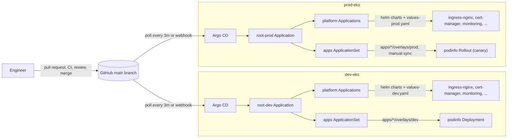

# Architecture

This repository is the single source of truth for two Kubernetes clusters, `dev-eks` and `prod-eks`. Each cluster runs its own Argo CD, and each Argo CD watches the `main` branch of this repository. Nothing is applied to a cluster by hand after bootstrap.

## Sync flow

## Layers

**Bootstrap.** `bootstrap/argocd` holds the Argo CD Application that points at the upstream `argo-cd` chart and at `bootstrap/argocd/values.yaml` in this repository. The first install is a plain `helm install`; once Argo CD is up, applying that Application makes Argo CD manage its own release. `bootstrap/<cluster>/root-app.yaml` is the root of the app-of-apps: one Application whose source is `clusters/<cluster>`.

**Clusters.** `clusters/<cluster>` is a kustomization that renders every Argo CD resource for that cluster: two AppProjects (`platform` and `apps`), one Application per platform component, the Application that installs Kyverno policies, the cluster's Karpenter NodePool, and one ApplicationSet. `clusters/base` carries the parts that are identical between clusters. The cluster directory patches in the `values-<cluster>.yaml` file for each component and, in prod, the sync windows.

**Platform.** `platform/<component>` is an Application for an upstream Helm chart, pinned to a chart version, plus a shared `values.yaml` and one `values-<env>.yaml` per environment. Argo CD reads the chart from the upstream repository and the values files from this repository (a multi-source Application with a `$values` ref). Components that need custom resources of their own, such as the cert-manager ClusterIssuers or the External Secrets ClusterSecretStore, keep them in a `resources/` kustomization synced one wave after the chart, so the CRDs exist first. `platform/prometheus-operator-crds` is the inverse case: it is the `monitoring.coreos.com` CRDs with no controller, installed at wave -1 because nearly every other chart here renders a ServiceMonitor. `platform/storage` is the one component with no chart: the EBS CSI driver is an EKS addon created in terraform-aws-platform, and all this repository adds is the gp3 StorageClass its volumes need.

**Apps.** `apps/<name>/base` is a complete, environment-neutral workload. `apps/<name>/overlays/<env>` sets the namespace, replica counts, resources, hostnames and the image tag. The ApplicationSet in each cluster uses the git directory generator over `apps/*/overlays/<env>`; adding a workload is adding a directory.

**Policies.** `policies/` holds Kyverno ClusterPolicies in Audit mode. They produce PolicyReports and metrics rather than blocking admission, which is the right first step for a small team: see what would fail, fix it, then flip to Enforce per policy.

## Sync order

Argo CD applies the root Application's children in sync waves. Argo CD does not assess health for `Application` resources by default, so `bootstrap/argocd/values.yaml` adds a Lua health check; without it every wave would proceed at once.

One rule decides the order: an Application that emits a custom resource syncs strictly after the Application that installs that kind. The table below is the whole set, and the last two columns are the audit.

| Wave | Application | Custom resources it emits | Kind comes from |
| --- | --- | --- | --- |
| -1 | prometheus-operator-crds | the 10 `monitoring.coreos.com` CRDs | nothing, it is the definition |
| 0 | argo-rollouts | ServiceMonitor | prometheus-operator-crds, wave -1 |
| 0 | cert-manager | ServiceMonitor | prometheus-operator-crds, wave -1 |
| 0 | external-secrets | ServiceMonitor | prometheus-operator-crds, wave -1 |
| 0 | karpenter | ServiceMonitor | prometheus-operator-crds, wave -1 |
| 0 | kyverno | ServiceMonitor, four of them | prometheus-operator-crds, wave -1 |
| 0 | metrics-server | ServiceMonitor | prometheus-operator-crds, wave -1 |
| 0 | storage | none, StorageClass is a core kind | core API |
| 1 | cert-manager-resources | ClusterIssuer | cert-manager, wave 0 |
| 1 | external-secrets-resources | ClusterSecretStore | external-secrets, wave 0 |
| 1 | karpenter-resources | EC2NodeClass, NodePool | karpenter, wave 0 |
| 1 | ingress-nginx | ServiceMonitor | prometheus-operator-crds, wave -1 |
| 2 | external-dns | ServiceMonitor | prometheus-operator-crds, wave -1 |
| 2 | kube-prometheus-stack-resources | ExternalSecret | external-secrets, wave 0 |
| 3 | kube-prometheus-stack | Prometheus, Alertmanager, ServiceMonitor, PrometheusRule | prometheus-operator-crds, wave -1 |
| 4 | kyverno-policies | ClusterPolicy | kyverno, wave 0 |
| 5 | apps ApplicationSet | ServiceMonitor, plus Rollout and AnalysisTemplate in prod | prometheus-operator-crds, wave -1, and argo-rollouts, wave 0 |

Four orderings in that table are load bearing and easy to break:

- **Wave -1 exists because almost every chart here renders a ServiceMonitor.** cert-manager, external-secrets, metrics-server, kyverno and karpenter all enable one at wave 0, and kube-prometheus-stack does not arrive until wave 3. Installing the operator CRDs on their own, in front of wave 0, is what lets a first sync into an empty cluster finish. kube-prometheus-stack sets `crds.enabled: false` so it no longer ships the same CRDs, and chart version 32.0.0 of `prometheus-operator-crds` carries operator v0.94.0, the version kube-prometheus-stack 91.4.1 deploys.
- **`kube-prometheus-stack-resources` needs two earlier waves, not one.** Its ExternalSecret needs the CRD from external-secrets at wave 0 and the `aws-secrets-manager` ClusterSecretStore from wave 1, and the Secret it writes has to exist before Grafana starts at wave 3. Wave 2 is the only slot that satisfies all three.
- **`karpenter-resources` is cluster specific and still has to wait for the controller.** The NodePool and EC2NodeClass at wave 1 come from `clusters/<cluster>`, not from `platform/karpenter`, so the dependency crosses directories.
- **Workloads are last.** The apps ApplicationSet sits at wave 5 so the Applications it generates cannot race the CRDs they need. In prod that includes Rollout and AnalysisTemplate from argo-rollouts at wave 0.

Two Applications sit outside the waves: `argocd` in `bootstrap/argocd` and the `root-<cluster>` Application in `bootstrap/<cluster>`. Both are applied with `kubectl apply -k` before Argo CD reconciles anything, and the `argoproj.io` CRDs their children need come from the first plain `helm install` of the argo-cd chart.

## Node capacity: Karpenter instead of Cluster Autoscaler

Cluster Autoscaler scales node groups that someone sized in advance: a fixed instance type per group, a minimum and a maximum, and a scan loop that adds one node at a time when pods stay pending. The ceiling is a guess made months earlier, and the instance type rarely matches what the pending pods actually asked for.

Karpenter works from the other end. It reads the pending pods, their requests, their topology and affinity constraints, and launches the cheapest instance that satisfies them, picking from every instance family the NodePool allows and from spot or on-demand capacity. When nodes sit underutilized it consolidates them onto fewer or cheaper instances, and it recycles nodes on a schedule so AMI updates roll through on their own. The only hand-set number left is the CPU and memory limit on the NodePool, which is a spend guardrail, not a capacity plan. The controller itself runs on a small managed node group that Karpenter does not touch, so it cannot remove the node it is running on.

## Progressive delivery on the critical path

A plain Deployment rollout is all or nothing: once the new ReplicaSet is healthy by its probes, it takes all the traffic. Probes say the process is up; they say nothing about whether it is returning errors to real users. For anything that handles money or sits on a login path, that gap is where incidents come from.

In prod, `podinfo` ships as an Argo Rollout with a canary strategy. The new version receives 10 percent of traffic through the ingress controller, then 50 percent, while an AnalysisTemplate queries Prometheus for the canary's HTTP success rate. If success drops below 99 percent, the rollout aborts and the stable version keeps serving before most users ever hit the new code. Dev keeps a plain Deployment, because dev exists to find problems quickly, not to hide them from anyone.
